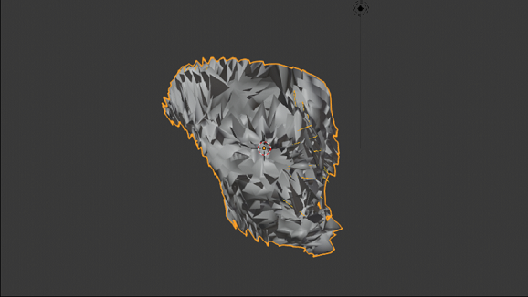

# T-Shirt-Mesh Generation from Image Data
```diff
- This is work in progress. I will update this Readme as soon as I have more results.
```
## Introduction
### Motivation
 When a trained artist sees a picture of an object he knows, it is relatively easy for him/her to imagine how that object would look like in 3D space and he/she could paint it from multiple different angles and inpaint details that are otherwise not given in the picture. The reason is that the artist has a model of that object in his mind already. Of course one can also be tricked by expectation. For example imagine you see a person and confuse him/her with another one you know, because the one you know has usually the same hairstyle, size, clothing etc. Only when you turn around him/her and see his/her face, you realize your mistake.  But anyway, the point is by having an expectation you are usually able to imagine an object from another perspective. My Idea has been to design a neural network model, that knows how a T-shirt looks like and given an images it can apply the correct folds on the side which it sees and gues the the folds on the side it doesn't see. Then it gives back 3D coordinates which you can apply on a t-shirt mesh in Blender.
### Similar Work
#### NeRF
 NeRF, which stands for neural radiance field, is the state of the art when it comes to creating a photorealistic highly detailed scene from images. However with their original approach you need to take a lot of images (100-1000) to get a good result. Their approach is to train a neural network on a single scene and let it overfit. Thats quite different from my approach, as I want to build a 3D object out of one single image (Note: There are also variants of the original NeRF model, e.g. PixelNeRF which can generate neural radiance fields from one or a few images, by using a convolutional layer across different scenes. I was not aware of this before going for my approach). Also their scene is build from voxel, which stands for volumetric pixel. A Voxel can be imagined as a block in Minecraft. Voxel based approaches are good if the focus is on sculpting things, you would use it to create a 3D brain based on brain scans, or for everything which you want to 3D print. In contrast most game engines use meshes, which is way less computationally expensive.


#### Pixel2Mesh
Pixel2Mesh is a neural network architecture which deforms and subdivides an elipsoid mesh to an object, given an image as input. It is trained on Shapenet which is a collection of 3d objects as .obj files. It has unfortunatly no t-shirts in their training set. For objects it is trained on the results are very impressive. On disadvantage though compared to my approach is that you do not have much control over the mesh. Suppose you have your default t-shirt in Blender where you have applied your fancy motives already and the only thing you want to do is to change the pose of the t-shirt multiple times to that what it is on an the images. With my Approach you can do just that, whit the Pixel2Mesh approach you would generate a completly new mesh each time with little to no consistency between these meshes.

Another example is if you would apply my approach not to T-shirts but to animateable human faces, where you just want to change the pose to what you see in an image. You would probably have made a complicated animation framework beforehand and you need the mesh to be consistent.

---

## Methods
### Generating Data with Blender
 I downloaded 2 different characters (Mannequin and Megan) and 3 different animations (hiphop, jumping jacks and rumba and capoeira) from mixamo. Then I followed a youtube tutorial on how to create t-shirts https://youtu.be/v54aD698Vv0. The number of subdivisions in the mesh is crucial with my approach. In my model I want to predict the position of each Vertex in the t-shirt mesh. As I don't want my model to be too big, the number of vertices can't be to high. 

Intuition: For a cube the formula for number of vertices depending on subdivisions is $v_s=(1+2^s)^3$. 

$v_0=8$

$v_1=27$

$v_2=125$

$v_3=729$

$v_4=4913$

$v_5=35937$

The number of vertices I use directly influences the size of the model, because I want to predict the coordinates of each vertice. I ended up with a t-shirt mesh which consists of just 2704 vertices. That makes the T-shirt behave more stiff then I would like to, but subdividing it once more would blow up the number of vertices to an order of magnitude.

 I applied the hiphop and capoeira animation to the mannequin and the rumba and jumping jacks animations to Megan. With the t-shirt on I baked the animation which results in an animation of the t-shirt without needing the characters. Then I predefined 24 rotations and  took one image(192 x 108) for  each rotation for each frame. The images taken are more or less always from the front, never from the back. Additionally to the images I saved the 2704 associated coordinates of the mesh for each frame and each rotation in a list of tuples as a text file.


Megans rumba animation. during the first 45 frames the T-shirt gets fitted to the character, then the animation starts. Only the frames after 45 are used for training.


* **_Pitfall 1:_** Originally I rotated the camera around the t-shirt instead of rotating the t-shirt. That way I needed only one coordinates file for each frame, not 24. The problem with that is that a position where the character leaned forward or the character rotated would confuse the model as it cant know the correct coordinates, when multiple are possible. That lead to the model not learning what it should. Huge loss spikes during training indicated this, after doing it the correct way (rotating the T-shirt instead) these huge spikes didn't happen anymore.

|    |   |
|:---:|:---:|
| In this version the camera rotates around the T-shirt. The coordinates of the t-shirt would stay the same | In this version the t-shirt itself rotates, the camera is fixed. The coordinates of the t-shirt change everytime. |


* **_Pitfall 2:_** The order of the vertices in a mesh is not necessarily the same across different blend files. The order can be shown by going to Preferences - Interface - Display, check 'Developer Extras'. In the 3D View - Overlays, there should now be a 'Developer' section, check its "Indices" box. With vertices selected you can rearange them with Mesh > Sort Elements. Since I did some small edits on the T-shirt from the male to the female mannequin, the order of the vertices changed, without me noticing that during my first iteration. That lead to horrible results. To fix this I put the cooridinates in a consistent order.

The indices are shown in the 3D Viewport. The order of the vertices is the same as the order of the coordinates in the coords file.


I generated 6192 images and coordinate files from the hiphop, rumba and jumping jacks animation as train set and 2640 images and coordinate files from the capoeira animation as test set.

* **_Pitfall 3:_** Initially I did a random train-test split. That is not a good Idea because of data leakage.
 Basically I have 24 images & coordinates for each frame, if I have the same mesh (just rotated) in the train and test data that is bad. It was fixed by using the capoeira animation as test data.


### Training the model

After generating the data the next step is to train the model (see Pixel2coords.ipynb) I loaded the images and labels (coordinates are the labels) into a tensorflow dataset. The final model has a size of 117,61 MB. It has 6 convolutional layer+avgPool layer pairs followed by 1 fully connected layer. The first layer has 48 filters, which is scaled to the last one having 363 filters .
As Loss I used Mean Squared Error (MSE), as metric I used Mean Absolute Error MAE. The model is trained for 1000 epochs (2*500). The model is trained on Google Colab, the training takes around 2 hours. It is saved as a keras file.

The formula for MSE is:
$$MSE=\frac{1}{n}\sum_{i=1}^{n}(y_i-\hat{y_i})^2$$
The formula for MAE is:
$$MAE=\frac{1}{n}\sum_{i=1}^{n}|y_i-\hat{y_i}|$$
where $y_i$ is the true coordinate and $\hat{y_i}$ is the predicted coordinate. $n$ is the number of coordinates.

### Results and Discussion

| ||
|:---:|:---:|


The final MSE for the test_set is around 1.18  and the final MAE around 0.77 which is bad compared to the train set, which has an MSE of around 0.003 and and an MSE of around 0.04. To bring that into perspective, the mesh has a diameter of around 12 units. So the mean positions is on average around $0.77//12=0.06$ units off compared to the whole mesh. And indeed, when applying the coordinates to the t-shirt the result looks not that convincing. It is to say, by eyeballing some examples it seems to get the orientation of the t-shirts right.


|  |  | |  |
|:---:|:---:|:---:|:---:|
|  |  | |  |
|  |  | |  |
|  |  | |  |
|  |  | |  |


 One reason the result is bad overall, might be that the capoeira animation, which builds the test set, is too different from the other three animations, because the characters lean more forward and one gets different angles. One obvious solution would be to generate more animations for the test set. An additional solution might to sort out unfair examples, when the camera angle points directly at the top or bottom of the t-shirt. Also since the val_loss doesn't get worse yet, one could train for longer. But I think the model is not good enough to get better results by training longer.


Unfair training Example

 To find the bad examples one could train a second neural network which assigns something like a confidence score. That would look as follows:
1) neural network 1 is tested with all images from the test set. We save the MSE for every single image. Bad examples would have a high MSE, good examples a low MSE
2) with the MSE-image pair we train a second neural network (confidence evaluating network), MSE as label, image as input. The networks learn to predict how good the example is.
3) We apply the confidence evaluating network to the whole train and test set. That way we can figure out with which the first NN would have problems with and we can exclude these unfair examples (examples above a specific MSE threshold).
4) later in production one could use the confidence evaluating network to reject bad examples before you apply it to the first neural network.

I will try to implement this in the future. What I also might explore is, if it helps to apply Fourier Feature Projection as that is what helped the guys from NeRF quite significantly.

